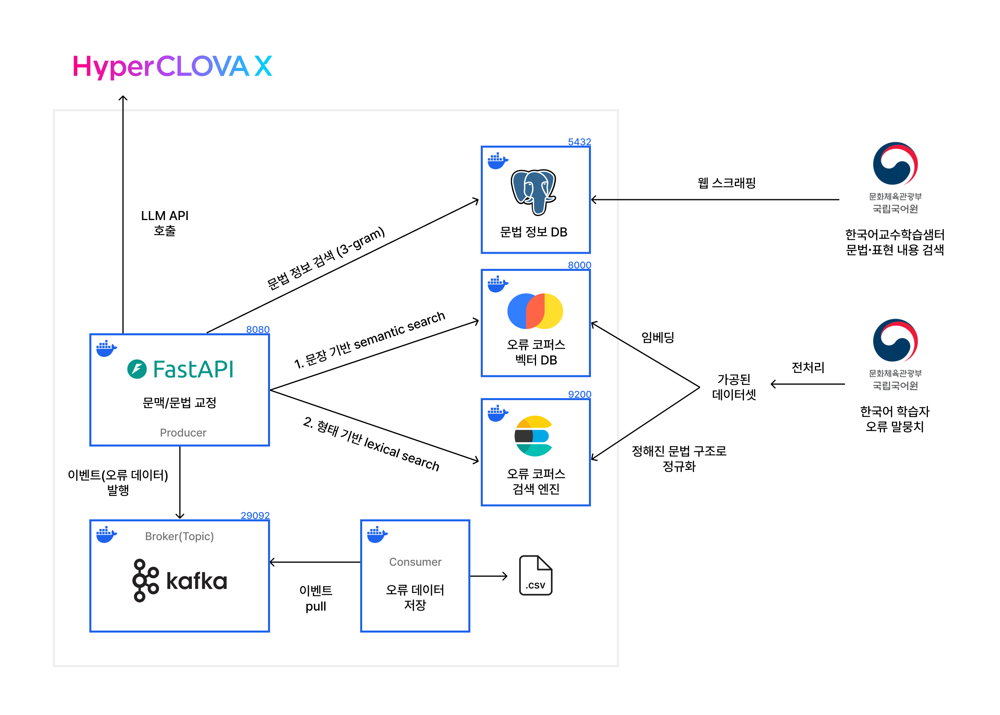
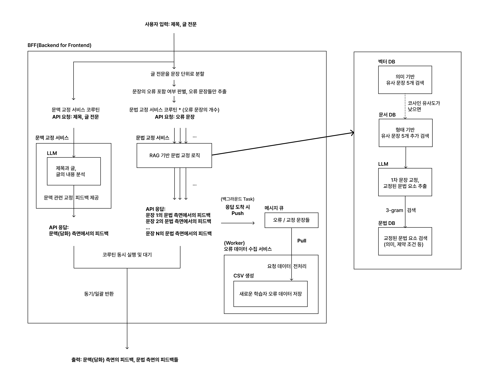

# 외국어로서의 한국어 학습자를 위한 RAG 기반 쓰기 피드백 시스템

> 2025-2 컴퓨터공학과 졸업 프로젝트  

<br>

해당 프로젝트는 한국어 학습자가 작성한 글에 대해 **RAG 기반의 문맥·문법 오류 교정 피드백**을 제공하는 시스템입니다.

한국어 쓰기 피드백에 특화된 플랫폼의 부재, 기존 문법 교정 시스템들이 보이는 부정확한 교정·일관성 부족 문제를 해결하기 위해,
<strong>한국어 학습자 오류 말뭉치 기반 벡터 검색(RAG)</strong>을 도입해 **정확하고 설명 가능한 피드백**을 생성하는 것을 목표로 합니다.

<br>

- API 서버 및 데이터 수집·전처리·임베딩·모델 준비 등을 포함한 데이터 파이프라인 구축 스크립트를 저장하는 Repository 입니다.

- [국립국어원 한국어 학습자 말뭉치 나눔터](https://kcorpus.korean.go.kr/index/goMain.do)의 오류 주석 말뭉치를 데이터셋으로 활용합니다. 

    - 원본·가공 데이터 및 원본 데이터에 대한 전처리 스크립트는 포함되어 있지 않습니다.
    - 제공받은 데이터셋은 오직 학술적 연구 목적으로만 사용합니다.

<br>

## 주요 기능

API 서버는 여러 서비스들의 협력을 통해 응답을 생성하는 <strong>BFF(Backend For Frontend)</strong> 구조로 설계되어 있습니다.

#### 1. 입력 데이터 처리

- KSS 기반 Sentence Splitter로 글 내용을 문장 단위로 분할
- KoNLPy(Mecab-ko) 형태소 분석을 통해 오류 포함 가능성 있는 문장 태깅

#### 2. 문법 교정 피드백 생성

- Clova Studio LLM Structured Output 기반 1차 교정
- 교정된 표현과 관련된 문법 정보 DB 조회
- ChromaDB로부터 학습자 오류 유형과 유사한 교정 데이터 조회
- Clova Studio 호출을 통해 최종 피드백 생성

#### 3. 문맥 교정 피드백 생성

- Clova Studio API 호출을 통해, 문맥의 자연스러움·글의 구성·제목 적합성 등에 대한 총평 생성

#### 4. 새로운 쓰기 오류 데이터 수집

- Kafka 기반 메시지 큐 파이프라인을 통해,
백그라운드에서 입력된 문장·교정 결과·LLM 피드백을 **CSV 기반 Raw Data 파일**로 로컬 스토리지에 저장
- 후속 연구를 위한 데이터셋 구축을 위함

<br>

## 실행 방법

```bash
docker compose up
```

- 프로젝트 루트의 `docker-compose.yml`를 사용합니다.

- **Clova Studio LLM API Key** 설정 필요:  

    `docker-compose.yml` 70번 라인의 환경 변수 **CLOVA_API_KEY**에 값을 입력하세요.

<br>

### [웹 클라이언트 연동]

- [웹 프론트엔드](https://github.com/mingdodev/korean-writing-feedback-web)를 통해 **문장 입력 → 피드백 결과 확인 흐름**을 테스트할 수 있습니다.

<br>

### [API 테스트]

#### 1. 테스트 실행

프로젝트 루트에서:

```bash
# MacOS / Linux
python3 api_test.py

# Windows
python api_test.py
```
#### 2. 테스트 요청 수정

`api_test.py` 내부의 **PAYLOAD** 부분을 수정하면 입력 텍스트를 바꿀 수 있습니다.

```python
PAYLOAD = {
    "title": "오늘의 일기",
    "contents": (
        "나는 비빔밥은 먹었고, 친구는 김치찌개 먹었다."
    )
}
```
실행하면 콘솔에 FastAPI 서버의 실제 응답(JSON)을 바탕으로 포맷된 결과가 출력됩니다.

<br>

## 서버 아키텍처

<p align="center">
  
</p>

<br>

## BFF 서비스 흐름

<p align="center">
  
</p>

<br>

## 참고 문헌

- 이승호, 이찬규 (2025). *RAG를 활용한 한국어교육 챗봇 구현 방안 - 한국어 학습자의 문법 교정을 중심으로*.  
- 강현화 외 6인 (2014). *한국어 표현 교육론*. 한국문화사.